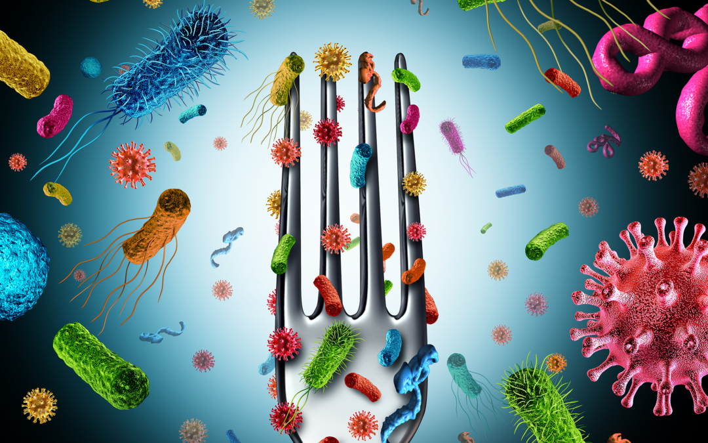

# Antimicrobial Activity Against Phytopathogens and Inhibitory Activity on Solanine in Potatoes of the Endophytic Bacteria Isolated From Potato Tubers

## Abstract
As an important global crop, the potato (Solanum tuberosum L.) contains the endotoxin solanine that leads to human poisoning and major economic losses. Poisoning symptoms and even acute poisoning may occur when the content of solanine in potatoes exceeds 200 mg/kg. In addition, potatoes are susceptible to some pathogenic bacteria, including Streptomyces scabies and Erwinia carotovora subsp. atroseptica (Van Hall) dye, which can cause potato scab and potato blackleg disease, respectively. In this study, 37 culturable endophytic bacteria strains were obtained from potato tubers based on the culture-dependent method. Results indicated that nine strains showed antimicrobial activity against at least one pathogen by antimicrobial activity screening and 23 strains showed inhibitory activity on solanine in potato tubers. Among them, strain P-NA2-14 (Bacillus megaterium NBRC 15308T, 99.31%) showed not only better antimicrobial activity against both the two indicator pathogens, but also the best inhibitory activity on solanine, which was proved to be a potential biocontrol bacterium. Meanwhile, the relationship between the distribution of the endophytic bacterial community and the content of solanine in potato tubers was studied by Illumina-based analysis, indicating that the distribution of the endophytic bacterial community was obviously influenced by the content of solanine. The results showed a new insight into the relationship between plant secondary metabolites and endophytic bacteria in potato tubers and provided potential new technical support for the biological control of potato storage.

**Keywords**: potato (Solanum tuberosum L.), endophytes, antimicrobial activity, solanine, active component, Illumina-based analysis

## Introduction

 The project is based on a study about <em>Solanum tuberosum</em> L. (potato), one of the most important food crops worldwide, ranking fourth after rice, wheat, and maize. In this context, it addresses a problem of industrial and health relevance: the increase in solanine content, a toxic compound belonging to the group of steroidal glycoalkaloids (SGAs), which can cause significant economic losses and pose a risk to human health when it exceeds certain concentration levels. 

 The introduction explains that, although there are chemical and genetic methods to reduce solanine —such as the use of sprout inhibitors (CIPC) or genetic modification— these present significant limitations due to their toxicity or instability. Therefore, the study proposes a safer alternative: the use of endophytic bacteria, beneficial microorganisms that inhabit plant tissues and can help control the increase of solanine, in addition to protecting the tuber against pathogens such as <em>Streptomyces scabies</em> and <em>Erwinia carotovora</em>. 

 The experimental work focuses on the isolation and identification of endophytic bacteria in potato tubers through culture methods, their evaluation by antimicrobial activity, and the correlation between their presence and solanine concentration using Illumina-based sequencing techniques. Ultimately, this study aims to offer a new biotechnological strategy to reduce solanine levels during storage, contributing to improved food safety and agricultural sustainability. 

 In the context of this GitHub introductory workshop, the text is used as a practical basis to learn how to create, manage, and document a scientific research repository. The introduction allows for practicing documentation skills in Markdown, version control, and the use of open licenses (MIT) in academic projects. 

## Material and methods
**Sterilizing Potato Samples**
 Potato samples (Crop Strains: DaXiYang) were collected from Ulanqab, Inner Mongolia Autonomous Region, China. All samples were stored at 4°C in cold storage. After the unpeeled potato samples were surface-sterilized according to the method in Wang et al. (2019), 200 μL of the final water rinse was plated on 11 different media (Supplementary Table 1). A total of 1% plant extracts of potato tubers were added to the 11 different media to offer natural growth conditions for the potential endophytic bacteria in plant tissues. The method of adding plant extracts of potato tubers to medium was as follow: 10 g potato tubers were squeezed in 100 mL of ultrapure water and filtered with four to six layers of gauze. A total of 10 mL plant extracts of potato tubers were added to the 1 L medium. Then the medium was sterilized at 121°C for 15 min. The different media were incubated at 28°C for 2 weeks to confirm the sterilization process was successful.

**Isolation and Identification of Endophytic Bacteria**
 <ins>Isolation of Endophytic Bacteria From Potato Tubers</ins>
 The sterilized potato tubers were cut by sterile surgical scissors into 0.5 ∼ 1.0 cm segments. The segments were then placed onto 11 different media and then incubated at 28°C until the bacterial colonies emerged.
Single-colony isolation was repeated at least three times by use of the YIM38 agar medium for purification of the endophytic bacteria isolates. Finally, the selected isolates were stored in 50% (v/v) glycerol [bacterial fluid: glycerol (50%) = 1:1, v/v] at −80°C. Criterion for strain nomenclature was as follow: P-medium type-strain number.

<ins>Identification of Endophytic Bacteria</ins>
 The endophytic bacteria DNA was extracted by the methods of Zhou et al. (2010). Then the 16S rDNA sequences of endophytic bacterial isolates were amplified with universal primers 27F (5′-AGAGTTTGATCCTGGCTCAG-3′) and 1492R (5′-TACGGCTACCTTGTTACGACTT-3′) by a thermocycler PCR system (Applied Biosystems, Singapore) (Mao et al., 2012). The PCR reaction was performed according to the method of Wang et al. (2019). The PCR products were checked on 1.2% agarose gel and were sequenced using the dideoxy chain-termination method. The two overlapping sequence reads of each endophytic bacterial isolate were assembled by the SeqMan of DNASTAR.Lasergene.7.1, then compared by the 16S-based ID of EzBioCloud (2018) database, and submitted to NCBI Genbank. The phylogenetic tree was constructed by the neighbor-joining method through the MEGA7.0 software.

**Screening for Antimicrobial Activity of Endophytic Bacteria Against Phytopathogen**
 <ins>Collection of Solvent Extract of Endophytic Bacteria</ins>
 Both the selected endophytic bacteria and actinomycetes were incubated in 150 mL YIM38 liquid medium at 28°C and 200 rpm, actinomycetes were shaken for 7 days and bacteria were shaken for 2 days. The supernatant was collected after the fermentation broth was centrifuged at 9,500 rpm for 20 min at 4°C, and mixed with an equal volume of ethyl acetate. The ethyl acetate layer was collected using a separating funnel and dried by the rotary evaporator (RE-52AA; YARONG, China) at 38°C. Then, the extracts were redissolved in 1 mL of methanol and stored at −20°C.

<ins>Screening for Antimicrobial Activity</ins>
 Erwinia carotovora subsp. atroseptica (Van Hall) dye (ACCC 19901) and S. scabies (ACCC 41024) were used to study the antimicrobial activities of the solvent extract. These phytopathogens were obtained from the Agricultural Culture Collection of China (ACCC). The antimicrobial activity was tested by the Kirby-Bauer test.
The test plates were prepared as follows: E. carotovora subsp. atroseptica (Van Hall) dye was cultured in 50 mL of the beef extract-peptone (BP) liquid medium with continuous shaking at 28°C and 200 rpm for 24 h, while S. scabies was cultured in 50 mL of the Kohlberg’s No. 1 (KN1) liquid medium under the same conditions. Then, 10 mL of the fermentation broth of the two phytopathogens were added to 100 mL of the BP and KN1 agar medium, respectively, and mixed gently. The mixed medium was poured on a petri dish slowly, which was used as the test plate. Sterilized paper disks (diameter, 6 mm) were saturated with the solvent extract (20 μL) and placed onto the test plates. An equivalent volume of methanol was used as negative control. Plates were then incubated at 28°C for 20 h. The diameter of the inhibition zones was measured to evaluate the effect of antimicrobial activity using an electronic digital caliper (0–150 mm).

<ins>Inhibitory Activity on Solanine in Potato Tubers</ins>
 An in vivo inhibition assay was designed to screen the single colony of selected isolates which could decrease the solanine in potato tubers. The single colony of endophytes were inoculated into 50 mL YIM38 liquid medium and incubated at 28°C with continuous shaking at 200 rpm for 24 h. The 20 mL of the inoculum (10%, v/v) was transferred into 200 mL fermentation medium (YIM38 liquid medium) and incubated at 28°C with continuous shaking at 200 rpm for 48 h, while the single colony of endophytic actinomycetes were shaken for 7 days under the same conditions. The unpeeled potato tubers were washed with running tap water and sprayed evenly with fermentation broth until the surface of the tubers were wet. An equivalent volume of YIM38 liquid medium without endophytic bacterial isolates was used as negative control, while an equivalent volume of chlorpropham (CIPC, a common potato bud suppressor on the market) served as positive control. Potato tubers were then stored under light at 28°C for 7 days. The content of solanine in potato tubers were determined by ultra-high performance liquid chromatography coupled to triple-quadrupole mass spectrometry (UPLC-QQQ-MS/MS) according to the method in Dai et al. (2017). There were six parallel samples in each group.

<ins>Extraction of Active Components of Strain P-NA2-14</ins>
 The strain P-NA2-14A was selected for further separation of active ingredients as it showed the highest inhibitory activity. It was fermented according to the method in Section “Inhibitory Activity on Solanine in Potato Tubers” and centrifuged at 9,500 rpm for 20 min at 4°C, the supernatant and pellet of the culture broth were collected separately. The supernatant was mixed with an equal volume of ethyl acetate, and the sediment was soaked in 15 mL of acetone for 24 h. Then, the potato tubers were sprayed evenly with 7 different groups of ingredients, including pure culture medium (F); ethyl acetate (EA); acetone (Ace); the acetone extracts of the sediment of strain P-NA2-14 (JT); the strain P-NA2-14 supernatant fermented broth (JY); the ethyl acetate extracts of the supernatant of strain P-NA2-14 (P-NA2-14EA); and the aqueous phase extract of the supernatant of strain P-NA2-14 (P-NA2-14A), to screen out the ingredient which had the most obvious inhibitory effect on solanine and would be used for further study.
The component P-NA2-14A that showed the highest inhibition on solanine was extracted using the column chromatography with AB-8 macroporous adsorption resin which was packed by the wet packing method. The P-NA2-14A was placed into macroporous adsorption resin and soaked for 2 h. Then the active components were eluted with different proportions of acetone-water (90, 80, 70, 60, 40, 20, and 10%, v/v) under a flow rate of 27 mL/min and collected in conical flasks every 10 min, respectively. The unpeeled potato tubers were sprayed evenly with the each collected active component. An equivalent volume of acetone and CIPC served as negative and positive controls, respectively. No less than three simultaneous experiments were performed for each component. Potato tubers were then stored under light for 7 days at 28°C. The content of solanine in potato tubers were determined using the same method as Section “Inhibitory Activity on Solanine in Potato Tubers.”

<ins>Illumina-Based Analysis of Endophytic Bacteria</ins>
 The unpeeled potato tubers were sprayed evenly with the different aqueous phase extract of the supernatant of strain P-NA2-14 until the surface of the tubers were wet, including Group CK (treated with blank medium, the content of solanine was 273 mg/kg); Group L (treated with the active ingredient 40–20, the content of solanine was 163 mg/kg); and Group H (treated with the active ingredient 20–30, the content of solanine was 344 mg/kg). Potato tubers were stored under light for 7 days at 28°C and then surface-sterilized as described in Section “Potato Samples Sterilizing.”
Microbial DNA was extracted from potato tubers using the E.Z.N.A.® Soil DNA Kit (Omega Bio-tek, Norcross, GA, United States). The V4–V5 region of the bacteria 16S rDNA sequences were amplified by PCR using primers 338F (5′-ACTCCTACGGGAGGCAGCAG-3′) and 806R (5′-GGACTACHVGGGTWTCTAAT-3′) (Huang X. et al., 2018). The PCR amplification procedure is shown in Supplementary Table 2. The PCR products were extracted from 2% agarose gels and further purified using the AxyPrep DNA Gel Extraction Kit (Axygen Biosciences, Union City, CA, United States) and quantified using QuantiFluorTM-ST (Promega, United States). Purified amplicons were pooled in equimolar and paired-end sequenced (2 × 250) on an Illumina MiSeq platform. The raw reads were deposited into the Sequence Read Archive (SRA) of the NCBI database. Raw fastq files were quality-filtered by Trimmomatic (v0.30) and merged by FLASH (v1.2.7) (Bolger et al., 2014). Operational Units (OTUs) were clustered with 97% similarity cutoff using UPARSE (2020) (v7.1) and chimeric sequences were identified and removed using UCHIME (2020) (Edgar et al., 2011). The taxonomy of each 16S rRNA gene sequence was analyzed by RDP Classifier (2020) (v2.2) against the SILVA (2020) 16S rRNA (Release132) database using a confidence threshold of 70%.
Operational Unit levels with 97% similarity were selected for Alpha diversity analyses using the Mothur (2020) (version v.1.30.1) and the diversity indices included Shannon (The Shannon diversity index), Simpson (The Simpson diversity index), Sobs (The observed richness), Chao (The Chao1 estimator), Ace (The ACE estimator), and Coverage (The Good’s coverage) (Kim et al., 2017; Yang et al., 2017). Rarefaction curves were plotted to determine the abundance of communities and sequencing data of the samples. A Venn diagram was used to show unique and shared OTUs using the stats package in R (Deng et al., 2018). *Principal Component Analysis* (PCA) and Hierarchical clustering analysis on the genus level were also determined using the vegan package in R, respectively to detect whether there was a significant difference between the samples.
## Results

> **Figure 1**. Percent of cultivable endophytes on the genus level.

> **Figure 2**. The tree of the 37 strains identified in this study. The tree was constructed with the neighbor-joining method with 1,000 bootstrap replicates. (GenBank accession numbers were given in parentheses. Strain name: P-medium type-strain number).

> **Figure 3**. Inhibition effect of fermentation broth of 37 strains on the solanine of potato tubers. Three replicates for each condition. Error bars represent standard error (n = 3). [CIPC: a common potato bud suppressor on the market, which served as positive control. An equivalent volume of YIM38 liquid medium without endophytic bacterial isolates was used as negative control. Inhibition rate (%) = A–B/B. A: The content of solanine in different conditions; B: the content of solanine in negative control].

> **Figure 4**. Effects of different components on the inhibition of solanine in potato tubers. Three replicates for each condition. Error bars represent standard error (n = 3). (F: potato tubers were sprayed evenly with the pure culture medium; EA: potato tubers were sprayed evenly with the ethyl acetate; Ace: potato tubers were sprayed evenly with the acetone; JT: potato tubers were sprayed evenly with acetone extracts of the sediment of strain P-NA2-14; JY: potato tubers were sprayed evenly with the strain P-NA2-14 supernatant fermented broth; P-NA2-14EA: potato tubers were sprayed evenly with the ethyl acetate extracts of the supernatant of strain P-NA2-14; and P-NA2-14A: potato tubers were sprayed evenly with the aqueous phase extract of the supernatant of strain P-NA2-14).

> **Figure 5**. Effects of different active components of P-NA2-14A on the inhibition of solanine in potato tubers. Three replicates for each condition. Error bars represent standard error (n = 3). (Group CIPC was treated with chlorpropham; Group MT was treated with acetone; Group JY was treated with strain P-NA2-14 supernatant fermented broth; Group JT was treated with strain P-NA2-14 cells; Groups 10–10, 10–20, and 10–30 were treated with 10% acetone extract collected in 0–10, 10–20, and 20–30 min, respectively; Groups 20–10, 20–20, and 20–30 were treated with 20% acetone extract collected in 0–10, 10–20, and 20–30 min, respectively; Groups 40–10, 40–20, and 40–30 were treated with 40% acetone extract collected in 0–10, 10–20, and 20–30 min, respectively; Groups 60–10, 60–20, and 60–30 were treated with 60% acetone extract collected in 0–10, 10–20, and 20–30 min, respectively; Groups 70–10, 70–20, and 70–30 were treated with 70% acetone extract collected in 0–10, 10–20, and 20–30 min, respectively; Groups 80–10, 80–20, and 80–30 were treated with 80% acetone extract collected in 0–10, 10–20, and 20–30 min, respectively; and Groups 90–10, 90–20, and 90–30 were treated with 90% acetone extract collected in 0–10, 10–20, and 20–30 min, respectively).

> **Figure 6**. Venn diagram showing the number of OTUs shared and unique among different samples. (Group CK: the unpeeled potato tubers were treated with blank medium, the content of solanine was 273 mg/kg; Group L: the unpeeled potato tubers were treated with the active ingredient 40–20, the content of solanine was 163 mg/kg; and Group H: the unpeeled potato tubers were treated with the active ingredient 20–30, the content of solanine was 344 mg/kg).

> **Figure 7**. Composition and relative abundance of endophytic bacterial in different samples on phylum level. Phyla making up less than 1% of total composition in the samples were classified as “other.”

> **Figure 8**. Composition and relative abundance of endophytic bacterial on the genus level. (A) Community analysis pie plot on the genus level of the culture-independent endophytic bacteria on the whole. (B) Composition and relative abundance of endophytic bacterial in different samples on the genus level. The color of the column represents the different genera, and the length of the column represents the proportion size of the genus. Sequences that could not be classified into any known group were assigned as “unclassified.” Genera making up less than 1% of total composition in each sample were classified as “other.” (Group CK: the unpeeled potato tubers were treated with blank medium, the content of solanine was 273 mg/kg; Group L: the unpeeled potato tubers were treated with the active ingredient 40–20, the content of solanine was 163 mg/kg; and Group H: the unpeeled potato tubers were treated with the active ingredient 20–30, the content of solanine was 344 mg/kg).

> **Figure 9**. The differences among the samples in different samples on genus level. (A) Principal Component Analysis (PCA) illustrates differences between bacterial communities in the three groups. (B) Heatmap of the top 50 most abundant genera in bacterial communities detected in the three groups. Dendrograms for hierarchical cluster analysis grouping genera and sample locations were shown at the left and at the top, respectively. (Group CK: the unpeeled potato tubers were treated with blank medium, the content of solanine was 273 mg/kg; Group L: the unpeeled potato tubers were treated with the active ingredient 40–20, the content of solanine was 163 mg/kg; and Group H: the unpeeled potato tubers were treated with the active ingredient 20–30, the content of solanine was 344 mg/kg).

## Discusion 

## References

1. Ai, M. J., Sun, Y., Sun, H. M., Liu, H. Y., Yu, L. Y., and Zhang, Y. Q. (2017). Allobranchiibius huperziae gen. nov., sp. nov., a member of Dermacoccaceae isolated from the root of a medicinal plant Huperzia serrata (Thunb.). Int. J. Syst. Evol. Microbiol. 67, 4210–4215. doi: 10.1099/ijsem.0.002284

2. Ali, H. F., Junaid, M., Ahmad, M., Bibi, A., Ali, A., Hussain, S., et al. (2013). Molecular and pathogenic diversity identified among isolates of Erwinia carotovora sub-species atroseptica associated with potato blackleg and soft rot. Pak. J. Bot. 45, 1073–1078.

3. Alkhazindar, M., Sayed, E. T. A., Khalil, M. S., and Zahran, D. (2016). Isolation and Characterization of Two Phages Infecting Streptomyces scabies. Res. J. Pharm. Biol. Chem. Sci. 7, 1363–1375. doi: 10.1007/BF02817996

4. Bakken, L. R., van Elsas, J. D., and Trevors, J. T. (1997). “Culturable and nonculturable bacteria in soil” in Modern Soil Microbiology, eds J. D. van Elsas, J. T. Trevors, and E. M. H. Wellington, (New York, NY: Marcel Dekker), 47–61.

5. Bolger, A. M., Lohse, M., and Usadel, B. (2014). Trimmomatic: a flexible trimmer for Illumina sequence data. Bioinformatics 30, 2114–2120. doi: 10.1093/bioinformatics/btu170

6. Borisova, R. B. (2011). Isolation of a Rhodococcus Soil Bacterium that Produces a Strong Antibacterial Compound. Ph.D. thesis, East Tennessee State University, Johnson City, TN.

7. Brader, G., Compant, S., Mitter, B., Trognitz, F., and Sessitsch, A. (2014). Metabolic potential of endophytic bacteria. Curr. Opin. Biotechnol. 27, 30–37. doi: 10.1016/j.copbio.2013.09.012

8. Camire, M. E., Kubow, S., and Donnelly, D. J. (2009). Potatoes and Human Health. Crit. Rev. Food. Sci. Nutr. 49, 823–840. doi: 10.1080/10408390903041996

9. Christina, A., Christapher, V., and Bhore, S. J. (2013). Endophytic bacteria as a source of novel antibiotics: an overview. Pharmacogn. Rev. 7, 11–16. doi: 10.4103/0973-7847.112833

10. Da, K., Nowak, J., and Flinn, B. (2012). Potato cytosine methylation and gene expression changes induced by a beneficial bacterial endophyte, Burkholderia phytofirmans strain PsJN. Plant. Physiol. Biochem. 50, 24–34. doi: 10.1016/j.plaphy

11. Dai, C., Zheng, L. F., Liu, J. M., Wang, F. Z., Sun, Y. F., Lu, J., et al. (2017). Effect of Storage Factors on the α-solanine Content of Potato Tubers Using Liquid Chromatography-mass Spectrometry. J. Nucl. Agric. Sci. 31, 2200–2205. doi: 10.11869/j.issn.100-8551.2017.11.2200

12. Dees, M. W., Lysøe, E., Rossmann, S., Perminow, J., and Brurberg, M. B. (2017). Pectobacterium polaris sp. nov., isolated from potato (Solanum tuberosum). Int. J. Syst. Evol. Microbiol. 67, 5222–5229. doi: 10.1099/ijsem.0.002448

13. Deng, J., Yin, Y., Zhu, W., and Zhou, Y. (2018). Variations in soil bacterial community diversity and structures among different revegetation types in the Baishilazi nature reserve. Front. Microbiol. 9:2874. doi: 10.3389/fmicb.2018.02874

14. Edgar, R. C., Haas, B. J., Clemente, J. C., Quince, C., and Knight, R. (2011). UCHIME improves sensitivity and speed of chimera detection. Bioinformatics 27, 2194–2200. doi: 10.1093/bioinformatics/btr381

15. Egamberdieva, D., Wirth, S., Behrendt, U., Ahmad, P., and Berg, G. (2017). Antimicrobial activity of medicinal plants correlates with the proportion of antagonistic endophytes. Front. Microbiol. 8:199. doi: 10.3389/fmicb.2017.00199

16. Ellis, R. J., Morgan, P., Weightman, A. J., and Fry, J. C. (2003). Cultivation-dependent and cultivation-independent approaches for determining bacterial diversity in heavy-metal-contaminated soil. Appl. Environ. Microbiol. 69, 3223–3230. doi: 10.1128/AEM.69.6.3223-3230.2003

17. Elshaghabee, F. M. F., Rokana, N., Gulhane, R. D., Sharma, C., and Panwar, H. (2017). Bacillus as potential probiotics: status, concerns, and future perspectives. Front. Microbiol. 8:1490. doi: 10.3389/fmicb.2017.01490

18. Etesami, H., Alikhani, H. A., and Hosseini, H. M. (2015). Indole-3-acetic acid (IAA) production trait, a useful screening to select endophytic and rhizosphere competent bacteria for rice growth promoting agents. MethodsX 2, 72–78. doi: 10.1016/j.mex.2015.02.008

19. EzBioCloud (2018). 16S-Based ID of EzBioCloud Database. Available online at: https://www.ezbiocloud.net/identify (accessed December, 2018).

20. Ferreira, C. M. H., Soares, H. M. V. M., and Soares, E. V. (2019). Promising bacterial genera for agricultural practices: an insight on plant growth-promoting properties and microbial safety aspects. Sci. Total Environ. 682, 779–799. doi: 10.1016/j.scitotenv.2019.04.225

21. Gahan, J., and Schmalenberger, A. (2014). The role of bacteria and mycorrhiza in plant sulfur supply. Front. Plant Sci. 5:723. doi: 10.3389/fpls.2014.00723

22. Gao, Y., Lu, Q., Pu, Z. P., Li, X., Ji, Q., He, Z., et al. (2015). An endophytic bacterium isolated from Panax ginseng CA Meyer enhances growth, reduces morbidity, and stimulates ginsenoside biosynthesis. Phytochem. Lett. 11, 132–138.

23. Grunenfelder, L. A., Knowles, L. O., Hiller, L. K., and Knowles, N. R. (2006). Glycoalkaloid development during greening of fresh market potatoes (Solanum tuberosum L.). J. Agric. Food Chem. 54, 584–754. doi: 10.1021/jf0607359

24. Hashem, A., Abd-Allah, E. F., Alqarawi, A. A., Al-Huqail, A. A., and Shah, M. A. (2016). Induction of osmoregulation and modulation of salt stress in Acacia gerrardii Benth. by arbuscular mycorrhizal fungi and Bacillus subtilis (BERA 71). BioMed Res. Int. 2016:6294098. doi: 10.1155/2016/6294098

25. Hennessy, R. C., Jørgensen, N. O. G., Scavenius, C., Enghild, J. J., Greve-Poulsen, M., Sørensen, O. B., et al. (2018). A screening method for the isolation of bacteria capable of degrading toxic steroidal glycoalkaloids present in potato. Front. Microbiol. 9:2648. doi: 10.3389/fmicb.2018.02648

26. Huang, W., Long, C., and Lam, E. (2018). Roles of plant-associated microbiota in traditional herbal medicine. Trends. Plant Sci. 23, 559–562. doi: 10.1016/j.tplants

27. Huang, X., Dong, W., Wang, H., and Feng, Y. (2018). Role of acid/alkali-treatment in primary sludge anaerobic fermentation: insights into microbial community structure, functional shifts and metabolic output by high-throughput sequencing. Bioresour. Technol. 249, 943–952. doi: 10.1016/j.biortech.2017.10.104

28. Hyeon, J. W., Jeong, S. E., Baek, K., and Jeon, C. O. (2017). Roseitalea porphyridii gen. nov., sp. nov., isolated from a red alga, and reclassification of Hoeflea suaedae Chung et al. 2013 as Pseudohoeflea suaedae gen. nov., comb. nov. Int. J. Syst. Evol. Microbiol. 67, 362–368. doi: 10.1099/ijsem.0.001633

29. Jeong, S. E., Kim, K. H., Lhee, D., Yoon, H. S., Quan, Z. X., Lee, E. Y., et al. (2019). Oceaniradius stylonematis gen. nov., sp. nov., isolated from a red alga, Stylonema cornu-cervi. Int. J. Syst. Evol. Microbiol. 69, 1967–1973. doi: 10.1099/ijsem.0.003413

30. Khan, M. S., Gao, J., Zhang, M., Chen, X. Q., Moe, T. S., Du, Y. P., et al. (2020). Isolation and characterization of plant growth-promoting endophytic bacteria Bacillus stratosphericus LW-03 from Lilium wardii. 3 Biotech 10:305. doi: 10.1007/s13205-020-02294-2

31. Kim, B. R., Shin, J., Guevarra, R. B., Lee, J. H., Kim, D. W., Seol, K. H., et al. (2017). Deciphering diversity indices for a better understanding of microbial communities. J. Microbiol. Biotechnol. 27, 2089–2093. doi: 10.4014/jmb.1709.09027

32. Kim, D., Choi, K. Y., Yoo, M., Zylstra, G. J., and Kim, E. (2018). Biotechnological potential of rhodococcus biodegradative pathways. J. Microbiol. Biotechnol. 28, 1037–1051. doi: 10.4014/jmb.1712.12017

33. Köberl, M., Schmidt, R., Ramadan, E. M., Bauer, R., and Berg, G. (2013). The microbiome of medicinal plants: diversity and importance for plant growth, quality, and health. Front. Microbiol. 4:400. doi: 10.3389/fmicb.2013.00400

34. Koffi, G. Y., Remaud-Simeon, M., Due, A. E., and Combes, D. (2017). Isolation and chemoenzymatic treatment of glycoalkaloids from green, sprouting and rotting Solanum tuberosum potatoes for solanidine recovery. Food Chem. 220, 257–265. doi: 10.1016/j.foodchem

35. Korpan, Y. I., Nazarenko, E. A., Skryshevskaya, I. V., Martelet, C., JaffrezicRenault, N., and El’skaya, A. V. (2004). Potato glycoalkaloids: true safety or false sense of security? Trends Biotechnol. 22, 147–151. doi: 10.1016/j.tibtech.2004.01.009

36. Lastochkina, O., Pusenkova, L., Garshina, D., Yuldashev, R., Shpirnaya, I., Kasnak, C., et al. (2020). The Effect of Endophytic Bacteria Bacillus subtilis and Salicylic Acid on Some Resistance and Quality Traits of Stored Solanum tuberosum L. Tubers Infected with Fusarium Dry Rot. Plants 9:738. doi: 10.3390/plants9060738

37. Li, F. N., Liao, S., Guo, M., Tuo, L., Yan, X., Li, W., et al. (2018). Mangrovicella endophytica gen. nov., sp. nov., a new member of the family Aurantimonadaceae isolated from Aegiceras corniculatum. Int. J. Syst. Evol. Microbiol. 68, 2838–2845. doi: 10.1099/ijsem.0.002907

38. Liu, Y., Liu, W., and Liang, Z. (2015). Endophytic bacteria from Pinellia ternata, a new source of purine alkaloids and bacterial manure. Pharm. Biol. 5, 1545–1548. doi: 10.3109/13880209.1016580

39. Mao, D. P., Zhou, Q., Chen, C. Y., and Quan, Z. X. (2012). Coverage evaluation of universal bacterial primers using the metagenomic datasets. BMC Microbiol. 12:66. doi: 10.1186/1471-2180-12-66

40. Massimiliano, M., Ofir, B., Kalliope, K. P., Hopkins, D. L., and Aleksa, O. (2020). Editorial: role of endophytes in plant health and defense against pathogens. Front. Plant Sci. 11:1312. doi: 10.3389/fpls.2020.01312

41. Miliute, I., Buzaite, O., Baniulis, D., and Stanys, V. (2015). Bacterial endophytes in agricultural crops and their role in stress tolerance: a review. Zemdirbyste Agric. 102, 465–478. doi: 10.13080/z-a.2015.102.060

42. Mothur (2020). Mothur (version v.1.30.2). Available online at: https://www.mothur.org/wiki/Download_mothur (accessed March, 2020).

43. Niu, X. B., Cui, W. G., Cui, M., Zhang, X. X., Zhang, S. Q., Xu, B. L., et al. (2018). Sphingobacterium solani sp. nov., isolated from potato stems. Int. J. Syst. Evol. Microbiol. 68, 1012–1017. doi: 10.1099/ijsem.0.002605

44. Pageni, B. B., Lupwayi, N. Z., Akter, Z., Larney, F. J., Kawchuk, L. M., and Gan, Y. (2014). Plant growth-promoting and phytopathogen-antagonistic properties of bacterial endophytes from potato (Solanum tuberosum L.) cropping systems. Can. J. Plant Sci. 94, 835–844. doi: 10.4141/cjps2013-356

45. Pasanen, M., Waleron, M., Schott, T., Cleenwerck, I., Misztak, A., Waleron, K., et al. (2020). Pectobacterium parvum sp. nov., having a Salmonella SPI-1-like Type III secretion system and low virulence. Int. J. Syst. Evol. Microbiol. 70, 2440–2448. doi: 10.1099/ijsem.0.004057

46. Pavlo, A., Leonid, O., Iryna, Z., Natalia, K., and Maria, P. A. (2011). Endophytic bacteria enhancing growth and disease resistance of potato (Solanum tuberosum L.). Biol. Control 56, 43–49. doi: 10.1016/j.biocontrol.2010.09.014

47. Radhakrishnan, R., Hashem, A., and Abd Allah, E. F. (2017). Bacillus: a biological tool for crop improvement through bio-molecular changes in adverse environments. Front. Physiol. 8:667. doi: 10.3389/fphys.2017.00667

48. Ramríez-Bahena, M. H., Cuesta, M. J., Tejedor, C., Igual, J. M., Fernández-Pascual, M., and Peix, Á. (2015a). Pseudomonas endophytica sp. nov., isolated from stem tissue of Solanum tuberosum L. in Spain. Int. J. Syst. Evol. Microbiol. 65, 2110–2117. doi: 10.1099/ijs.0.000230

49. Ramríez-Bahena, M. H., Flores-Félix, J. D., Cuesta, M. J., Tejedor Gil, C., Palomo, J. L., Garcaí Benavides, P., et al. (2015b). Fontibacillus solani sp. nov. isolated from potato (Solanum tuberosum L.) root. Antonie Van Leeuwenhoek 107, 1315–1321. doi: 10.1007/s10482-015-0426-2

50. RDP Classifier (2020). RDP Classifier (v2.2). Available online at: https://sourceforge.net/projects/rdp-classifier/ (accessed March, 2020).

51. Sawai, S., Ohyama, K., Yasumoto, S., Seki, H., Sakuma, T., Yamamoto, T., et al. (2014). Sterol side chain reductase 2 is a key enzyme in the biosynthesis of cholesterol, the common precursor of toxic steroidal glycoalkaloids in potato. Plant Cell 26, 3763–3774. doi: 10.1105/tpc.114.130096

52. SILVA (2020). SILVA 16S rRNA (Release132) Database. Available online at: https://www.arb-silva.de/ (accessed March, 2020).

53. Singh, N., and Chaudhari, S. M. (2012). Management of black scurf (Rhizoctonia solani) and common scab (Streptomyces scabies) of potato through eco-friendly components. Indian Phytopathol. 65, 378–381.

54. Smith, M. J., and Bucher, G. (2012). Tools to study the degradation and loss of the N-phenyl carbamate chlorpropham-A comprehensive review. Environ. Int. 49, 38–50. doi: 10.1016/j.envint.2012.08.005

55. Soutar, C. D., and Stavrinides, J. (2018). The evolution of three siderophore biosynthetic clusters in environmental and host-associating strains of Pantoea. Mol. Gen. Genomics 293, 1453–1467. doi: 10.1007/s00438-018-1477-7

56. Stein, T. (2005). Bacillus subtilis antibiotics: structures, syntheses and specific functions. Mol. Microbiol. 56, 845–857.

57. Strobel, G. A., and Long, D. M. (1998). Endophytic microbes embody pharmaceutical potential. ASM News 64, 263–268.

58. Sturz, A. V., and Matheson, B. G. (1996). Populations of endophytic bacteria which influence host-resistance to Erwinia-induced bacterial soft rot in potato tubers. Plant Soil 184, 265–271. doi: 10.1007/bf00010455

59. Turner, T. R., James, E. K., and Poole, P. S. (2013). The plant microbiome. Genome Biol. 14:209. doi: 10.1186/gb-2013-14-6-209

60. UCHIME (2020). UCHIME. Available online at: http://www.drive5.com/usearch/manual/uchime_algo.html (accessed March, 2020).

61. UPARSE (2020). UPARSE (v7.1). Available online at: http://drive5.com/uparse/ (accessed March, 2020).

62. Wang, S. S., Liu, J. M., Sun, J., Sun, Y. F., Liu, J. N., Jia, N., et al. (2019). Diversity of culture-independent bacteria and antimicrobial activity of culturable endophytic bacteria isolated from different Dendrobium stems. Sci. Rep. 9:10389. doi: 10.1038/s41598-019-46863-9

63. Yamada, Y., Kuzuyama, T., Komatsu, M., Shinya, K., Omura, S., Cane, D. E., et al. (2015). Terpene synthases are widely distributed in bacteria. Proc. Natl. Acad. Sci. U.S.A. 112, 857–862. doi: 10.1073/pnas.1422108112

64. Yang, H. T., Tang, W. H., Chi, J. G., Xu, Y. K., and Wang, J. N. (2002). Identification of phytogenic control strain B1301 and its mechanism of action and control effect on ginger bacterial wilt. Chin. J. Biol. Control 18, 21–23. doi: 10.3969/j.issn.2095-039X.2002.01.006

65. Yang, Y., Dou, Y., Huang, Y., and An, S. (2017). Links between soil fungal diversity and plant and soil properties on the loess plateau. Front. Microbiol. 8:2198. doi: 10.3389/fmicb.2017.02198

66. Yuan, J., Sun, F., Tian, H., Cui, L., and Zhao, T. (2002). Isolation and screening of beneficial endophytic bacterial control bacterial ring rot of potato. Acta Microbiol. Sin. 42, 270–274. doi: 10.1006/jfls.2001.0409

67. Zhou, S. Q., Huang, X. L., Huang, D. Y., Hu, X. W., and Chen, J. L. (2010). A rapid method for extracting DNA from actinomycetes by chelex-100. Biotechnol. Bull. 20, 123–125. doi: 10.1017/S0004972710001772

## License
This project is under license [MIT](LICENSE).
